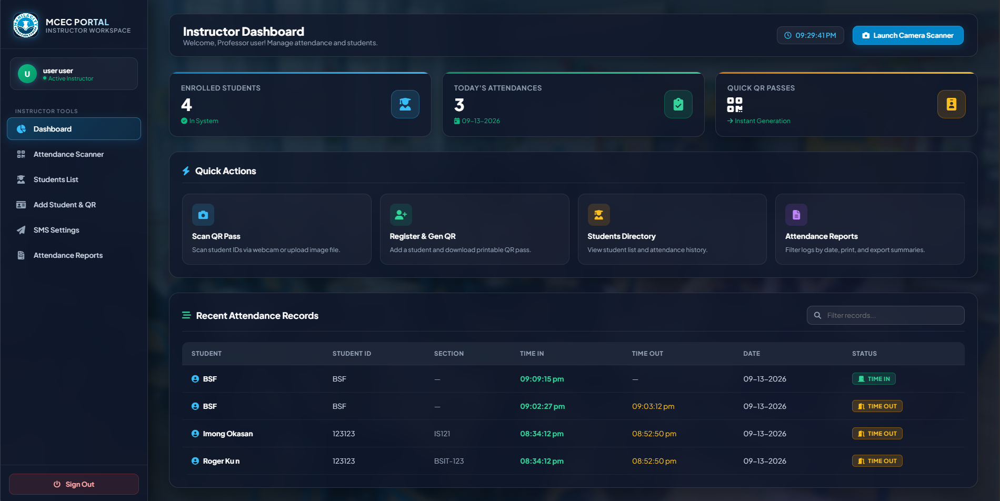
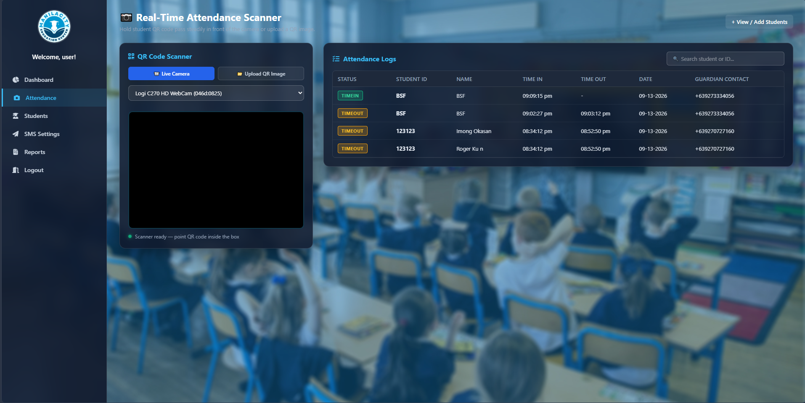

# Web-Based Attendance Management System

A fast, reliable, and automated attendance tracking system featuring dynamic **QR Code generation** and **SMS Gateway notification integration**.

> Efficiently automate attendance verification, reduce manual recordkeeping errors, and send real-time SMS alerts to users upon scanning.

| Resource | Link |
| :--- | :--- |
| **Live Demo** | `http://localhost/projectAttendanceSystem` |
| **Database Schema** | `database/attendance_db.sql` |
| **SMS API Docs** | [Twilio API Reference](https://www.twilio.com/docs) / [Semaphore API](https://semaphore.co/docs) |

---

<table border="0">
  <tr>
    <td align="center" width="50%">
      
       
      <b>Dashboard</b>
    </td>
    <td align="center" width="50%">
      
       
      <b>Attendance</b>
    </td>
  </tr>
</table>

---

## Features 💥

- **Session-Based Authentication:** Secure user login and registration routes for students and administrators.
- **Instructor Dashboard:** Real-time visibility into daily logs, user activity, and attendance history export options.
- **Dynamic QR Code Scanning:** Instant check-in/check-out verification using digital QR codes.
- **Automated SMS Gateway Integration:** Sends instant confirmation messages directly to user devices via API when attendance is logged.
- **Database Persistence:** Managed centralized recordkeeping backed by MySQL.

---

## SMS Gateway Integration (QR Code Workflow) 📱

The attendance system integrates an external **SMS Gateway API** (e.g., *Twilio* or *Semaphore*) to deliver instant SMS notifications when a QR code is scanned.
